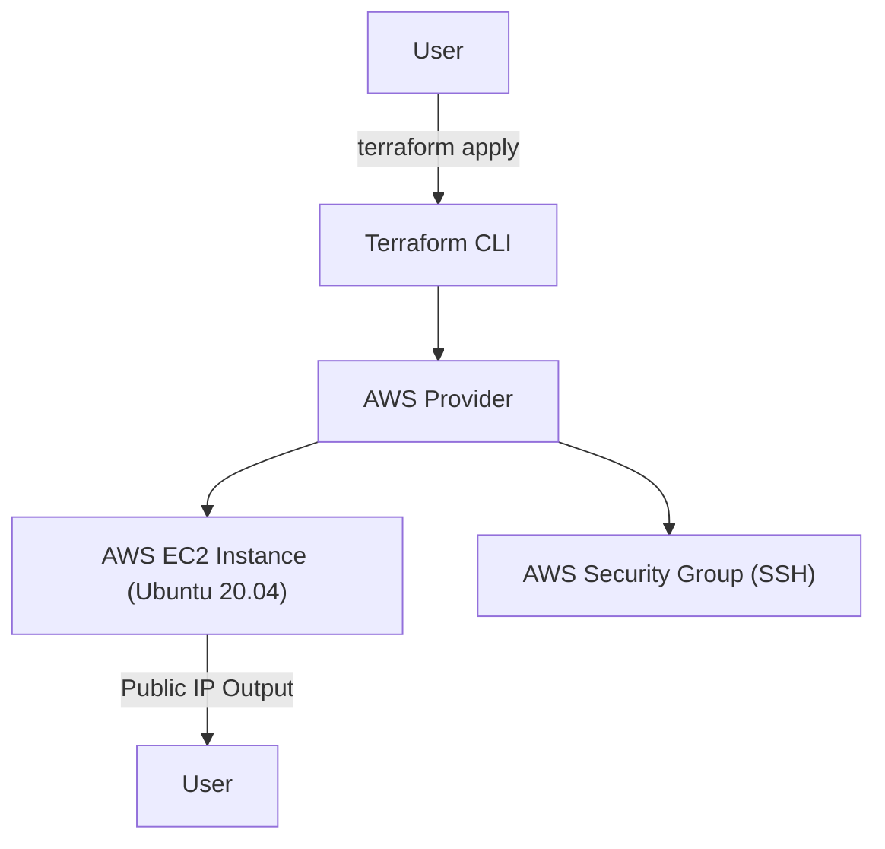

# Terraform AWS EC2 Deployment

[](https://www.terraform.io/)
[](https://aws.amazon.com/)
[](LICENSE)

---

> **Empower your cloud journey with automated, secure, and production-ready AWS infrastructure.**

---

## Table of Contents
- [Terraform AWS EC2 Deployment](#terraform-aws-ec2-deployment)
  - [Table of Contents](#table-of-contents)
  - [Overview](#overview)
  - [Architecture](#architecture)
  - [Features](#features)
  - [Use Cases](#use-cases)
  - [Getting Started](#getting-started)
    - [Prerequisites](#prerequisites)
    - [Quickstart](#quickstart)
  - [Best Practices](#best-practices)
  - [Outputs](#outputs)
  - [Extensibility](#extensibility)
  - [Contributing](#contributing)
  - [Contact](#contact)
  - [License](#license)

---

## Overview
This project delivers a **turnkey solution** for deploying a secure, tagged Ubuntu EC2 instance on AWS using Terraform. Designed for both rapid prototyping and as a robust foundation for production workloads, it demonstrates best practices in infrastructure-as-code, security, and cloud automation.

---

## Architecture



- **Provider:** AWS (region: `eu-north-1`)
- **Resources:**
  - EC2 instance (Ubuntu 20.04 LTS, `t3.micro`)
  - Security Group allowing SSH (port 22, customizable)
  - Uses the default VPC

---

## Features
- 🚀 **One-command deployment** of a ready-to-use Ubuntu server
- 🔒 **Security group** with SSH access (default open, easily restricted)
- 🏷️ **Resource tagging** for easy management
- 🌐 **Public IP output** for instant access
- 🛠️ **Modular, extensible codebase**

---

## Use Cases
- **Technical interviews & coding challenges**: Instantly spin up a cloud server
- **Learning & demos**: Showcase Terraform and AWS skills
- **Production foundation**: Adapt for real-world workloads
- **DevOps portfolio**: Impress recruiters with clean, automated infrastructure

---

## Getting Started

### Prerequisites
- [Terraform](https://www.terraform.io/downloads.html) >= 1.0.0
- AWS account & credentials (via environment variables or AWS CLI)
- Existing EC2 key pair (update `key_name` in `main.tf`)

### Quickstart
1. **Clone the repository:**
   ```bash
   git clone <repo-url>
   cd terraform-aws
   ```
2. **Initialize Terraform:**
   ```bash
   terraform init
   ```
3. **Customize variables:**
   - Set your `key_name` in `main.tf`
   - (Optional) Restrict SSH CIDR in `security_group.tf`
4. **Deploy:**
   ```bash
   terraform apply
   ```
5. **Connect:**
   ```bash
   ssh -i <path-to-your-private-key> ubuntu@<public-ip>
   ```

---

## Best Practices
- **Restrict SSH access**: Change `cidr_blocks` in `security_group.tf` from `0.0.0.0/0` to your IP range
- **Never commit secrets**: Keep private keys and credentials out of version control
- **Use remote state**: For team or production use, configure [remote state backends](https://www.terraform.io/language/state/remote)
- **Tag resources**: For cost tracking and management

---

## Outputs
- `public_ip`: The public IP address of your EC2 instance

---

## Extensibility
- Add more AWS resources (RDS, S3, etc.) as needed
- Parameterize instance type, region, and AMI via variables
- Integrate with CI/CD for automated deployments

---

## Contributing
Contributions, issues, and feature requests are welcome! Please open an issue or submit a pull request.

---

## Contact
**Project Maintainer:** [Your Name](mailto:your.email@example.com)

Connect with me on [LinkedIn](https://www.linkedin.com/) or [GitHub](https://github.com/).

---

## License
This project is licensed under the MIT License. See the [LICENSE](LICENSE) file for details. 