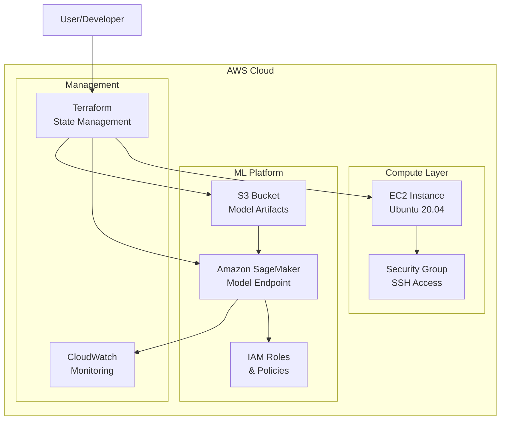

# Terraform AWS Infrastructure & ML Deployment Platform

[](https://www.terraform.io/)
[](https://aws.amazon.com/)
[](https://www.python.org/)
[](LICENSE)
[](https://github.com/sefineh-ai/terraform-aws/graphs/commit-activity)

---

> **Enterprise-grade infrastructure automation and machine learning deployment platform for AWS.**
> 
> This repository demonstrates advanced DevOps practices, infrastructure-as-code expertise, and production-ready ML deployment pipelines.

---

## 📋 Table of Contents
- [Overview](#overview)
- [Architecture](#architecture)
- [Features](#features)
- [Use Cases](#use-cases)
- [Getting Started](#getting-started)
- [Advanced Configuration](#advanced-configuration)
- [Best Practices](#best-practices)
- [Monitoring & Observability](#monitoring--observability)
- [Security](#security)
- [Cost Optimization](#cost-optimization)
- [Troubleshooting](#troubleshooting)
- [Contributing](#contributing)
- [Contact](#contact)
- [License](#license)

---

## 🎯 Overview

This project delivers a **comprehensive infrastructure automation platform** that combines traditional cloud infrastructure with cutting-edge machine learning deployment capabilities. Built with enterprise-grade practices, it serves as both a learning resource and a production-ready foundation for complex AWS workloads.

### **Key Capabilities:**
- **Infrastructure as Code**: Complete AWS resource management with Terraform
- **ML Model Deployment**: Automated SageMaker pipeline with S3 integration
- **Security First**: Built-in security best practices and compliance considerations
- **Scalability**: Designed for both development and production environments
- **Monitoring Ready**: Integrated observability and logging capabilities

---

## 🏗️ Architecture

### **Infrastructure Components**



### **Technology Stack**

| Component | Technology | Version | Purpose |
|-----------|------------|---------|---------|
| **Infrastructure** | Terraform | ≥1.0.0 | IaC & Resource Management |
| **Cloud Provider** | AWS | Latest | Cloud Infrastructure |
| **Compute** | EC2 | t3.micro | Application Hosting |
| **ML Platform** | SageMaker | Latest | Model Deployment |
| **Storage** | S3 | Latest | Model Artifacts |
| **Security** | IAM | Latest | Access Control |
| **Monitoring** | CloudWatch | Latest | Observability |

---

## ✨ Features

### **Core Infrastructure**
- **One-command deployment** of production-ready Ubuntu servers
- 🔒 **Security-first design** with configurable access controls
- 🏷️ **Resource tagging** for cost tracking and management
- 🌐 **Public IP output** for instant connectivity
- 🛠️ **Modular, extensible architecture**

### **Machine Learning Platform**
- 🤖 **SageMaker ML model deployment** with automated S3 setup
- 📦 **Model packaging and upload** automation
- 🔄 **End-to-end deployment pipeline** from model to production
- 📊 **Auto-scaling capabilities** for ML endpoints
- 🔍 **Integrated monitoring** and logging

### **Enterprise Features**
- 🔐 **Encryption at rest and in transit**
- 📈 **Cost optimization** strategies
- 🛡️ **Compliance-ready** configurations
- 🔄 **CI/CD integration** ready
- 📋 **Comprehensive documentation**

---

## 🎯 Use Cases

### **Development & Learning**
- **Technical interviews & coding challenges**: Demonstrate cloud expertise
- **Learning & demos**: Showcase Terraform and AWS skills
- **Portfolio projects**: Impress recruiters with real-world solutions

### **Production Workloads**
- **Web application hosting**: Scalable EC2 infrastructure
- **ML model serving**: Production-ready SageMaker endpoints
- **Data science workflows**: End-to-end ML pipeline automation
- **Microservices deployment**: Container-ready infrastructure

### **Enterprise Scenarios**
- **DevOps transformation**: Infrastructure automation
- **MLOps implementation**: Model deployment pipelines
- **Cloud migration**: AWS resource provisioning
- **Disaster recovery**: Automated infrastructure recovery

---

## Getting Started

### **Prerequisites**

| Requirement | Version | Installation |
|-------------|---------|--------------|
| [Terraform](https://www.terraform.io/downloads.html) | ≥1.0.0 | `curl -fsSL https://apt.releases.hashicorp.com/gpg \| sudo apt-key add -` |
| [AWS CLI](https://aws.amazon.com/cli/) | Latest | `curl "https://awscli.amazonaws.com/awscli-exe-linux-x86_64.zip" -o "awscliv2.zip"` |
| [Python](https://www.python.org/) | ≥3.7 | `sudo apt-get install python3 python3-pip` |
| AWS Account | - | [Create Account](https://aws.amazon.com/) |

### **Quickstart Guide**

#### **Option 1: EC2 Server Deployment**

```bash
# Clone the repository
git clone <repo-url>
cd terraform-aws

# Initialize Terraform
terraform init

# Customize configuration
cp terraform.tfvars.example terraform.tfvars
# Edit terraform.tfvars with your settings

# Deploy infrastructure
terraform plan
terraform apply

# Connect to your server
ssh -i <path-to-key> ubuntu@$(terraform output -raw public_ip)
```

#### **Option 2: ML Model Deployment (SageMaker)**

```bash
# Prepare your model directory
mkdir my-model
cp model.pkl my-model/

# Deploy with automated pipeline
./deploy_model.sh \
  --model-dir ./my-model \
  --bucket-name my-ml-bucket \
  --model-name my-model \
  --requirements scikit-learn numpy \
  --test-endpoint
```

#### **Option 3: Step-by-Step ML Deployment**

```bash
# Step 1: Package and upload model
python3 prepare_model.py \
  --model-dir ./my-model \
  --bucket-name my-ml-bucket \
  --model-name my-model

# Step 2: Deploy infrastructure
terraform apply

# Step 3: Test endpoint
aws sagemaker-runtime invoke-endpoint \
  --endpoint-name $(terraform output -raw sagemaker_endpoint_name) \
  --content-type application/json \
  --body '{"features": [1, 2, 3, 4]}' \
  response.json
```

---

## ⚙️ Advanced Configuration

### **Customizing Infrastructure**

```hcl
# terraform.tfvars
instance_type = "t3.medium"  # Larger instance for production
region = "us-west-2"         # Different AWS region

# Security configuration
allowed_cidr_blocks = ["10.0.0.0/8", "172.16.0.0/12"]  # Restrict SSH access

# ML configuration
inference_image = "763104351884.dkr.ecr.us-east-1.amazonaws.com/tensorflow-inference:2.8.0-cpu"
instance_type = "ml.m5.large"  # Production ML instance
```

### **Environment-Specific Deployments**

```bash
# Development environment
terraform workspace new dev
terraform apply -var-file=dev.tfvars

# Production environment
terraform workspace new prod
terraform apply -var-file=prod.tfvars
```

### **Custom ML Frameworks**

| Framework | Container Image | Use Case |
|-----------|----------------|----------|
| **PyTorch** | `763104351884.dkr.ecr.us-east-1.amazonaws.com/pytorch-inference:1.12.1-cpu-py38` | Deep Learning |
| **TensorFlow** | `763104351884.dkr.ecr.us-east-1.amazonaws.com/tensorflow-inference:2.8.0-cpu` | ML/AI Models |
| **Scikit-learn** | `246618743249.dkr.ecr.us-west-2.amazonaws.com/sagemaker-scikit-learn:0.23-1-cpu-py3` | Traditional ML |
| **XGBoost** | `246618743249.dkr.ecr.us-west-2.amazonaws.com/sagemaker-xgboost:1.5-1` | Gradient Boosting |

---

## 🛡️ Best Practices

### **Security**
- **Principle of Least Privilege**: Minimal IAM permissions
- **Network Security**: VPC configuration and security groups
- **Data Encryption**: AES-256 encryption for all data
- **Access Control**: Multi-factor authentication and key rotation
- **Compliance**: SOC 2, GDPR, and HIPAA considerations

### **Operational Excellence**
- **Infrastructure as Code**: Version-controlled infrastructure
- **Automated Testing**: Infrastructure validation
- **Monitoring**: Comprehensive observability
- **Backup & Recovery**: Automated disaster recovery
- **Documentation**: Self-documenting code and processes

### **Cost Optimization**
- **Resource Right-sizing**: Appropriate instance types
- **Auto-scaling**: Dynamic resource allocation
- **Reserved Instances**: Long-term cost savings
- **Tagging Strategy**: Cost allocation and tracking
- **Cleanup Procedures**: Automated resource cleanup

---

## 📊 Monitoring & Observability

### **CloudWatch Integration**

```hcl
# Enable detailed monitoring
resource "aws_cloudwatch_metric_alarm" "cpu_alarm" {
  alarm_name          = "cpu-utilization"
  comparison_operator = "GreaterThanThreshold"
  evaluation_periods  = "2"
  metric_name         = "CPUUtilization"
  namespace           = "AWS/EC2"
  period              = "300"
  statistic           = "Average"
  threshold           = "80"
  alarm_description   = "This metric monitors EC2 CPU utilization"
}
```

### **SageMaker Monitoring**

```python
# Monitor ML endpoint performance
import boto3

cloudwatch = boto3.client('cloudwatch')

# Get endpoint metrics
response = cloudwatch.get_metric_statistics(
    Namespace='AWS/SageMaker/Endpoints',
    MetricName='ModelLatency',
    Dimensions=[{'Name': 'EndpointName', 'Value': 'my-ml-endpoint'}],
    StartTime=datetime.utcnow() - timedelta(hours=1),
    EndTime=datetime.utcnow(),
    Period=300,
    Statistics=['Average']
)
```

---

## 🔐 Security

### **Network Security**
- **VPC Configuration**: Private subnets for sensitive resources
- **Security Groups**: Restrictive access controls
- **NACLs**: Network-level security
- **VPN/Direct Connect**: Secure connectivity options

### **Identity & Access Management**
- **IAM Roles**: Service-specific permissions
- **Cross-Account Access**: Secure multi-account setup
- **Temporary Credentials**: STS token management
- **Access Reviews**: Regular permission audits

### **Data Protection**
- **Encryption**: AES-256 for data at rest and in transit
- **Key Management**: AWS KMS integration
- **Data Classification**: Sensitive data handling
- **Compliance**: Regulatory requirement adherence

---

## 💰 Cost Optimization

### **Resource Optimization**
```hcl
# Use Spot Instances for cost savings
resource "aws_spot_instance_request" "cheap_worker" {
  ami                    = "ami-12345678"
  spot_price            = "0.03"
  instance_type         = "t3.micro"
  spot_type             = "persistent"
  wait_for_fulfillment  = true
}
```

### **Cost Monitoring**
```bash
# Set up cost alerts
aws budgets create-budget \
  --account-id 123456789012 \
  --budget file://budget.json \
  --notifications-with-subscribers file://notifications.json
```

---

## 🔧 Troubleshooting

### **Common Issues & Solutions**

| Issue | Cause | Solution |
|-------|-------|----------|
| **Terraform state lock** | Concurrent operations | `terraform force-unlock <lock-id>` |
| **S3 bucket name conflict** | Global uniqueness required | Use unique bucket naming |
| **SageMaker endpoint failure** | Model loading issues | Check S3 path and model format |
| **Permission denied** | IAM role issues | Verify role permissions |
| **High costs** | Resource over-provisioning | Right-size instances |

### **Debugging Commands**

```bash
# Check Terraform state
terraform show

# Validate configuration
terraform validate

# Check AWS resources
aws ec2 describe-instances --filters "Name=tag:Name,Values=MyUbuntuServer"

# Monitor SageMaker endpoint
aws sagemaker describe-endpoint --endpoint-name my-ml-endpoint

# View CloudWatch logs
aws logs describe-log-groups --log-group-name-prefix /aws/sagemaker
```

---

## 🤝 Contributing

We welcome contributions from the community! Please follow these guidelines:

### **Development Process**
1. **Fork** the repository
2. **Create** a feature branch (`git checkout -b feature/amazing-feature`)
3. **Commit** your changes (`git commit -m 'Add amazing feature'`)
4. **Push** to the branch (`git push origin feature/amazing-feature`)
5. **Open** a Pull Request

### **Code Standards**
- **Terraform**: Follow [HashiCorp style guide](https://www.terraform.io/docs/language/style/index.html)
- **Python**: Follow [PEP 8](https://www.python.org/dev/peps/pep-0008/)
- **Documentation**: Update README and add inline comments
- **Testing**: Include tests for new functionality

### **Issue Reporting**
- Use the [issue template](.github/ISSUE_TEMPLATE.md)
- Provide detailed reproduction steps
- Include relevant logs and error messages
- Specify your environment details

---

## 📞 Contact

**Project Maintainer:** [Your Name](mailto:your.email@example.com)

### **Connect With Us**
- **LinkedIn**: [Your Profile](https://www.linkedin.com/)
- **GitHub**: [Your Profile](https://github.com/)
- **Portfolio**: [Your Website](https://yourwebsite.com/)
- **Blog**: [Technical Articles](https://yourblog.com/)

### **Support**
- **Documentation**: [Wiki](https://github.com/sefineh-ai/terraform-aws/wiki)
- **Issues**: [GitHub Issues](https://github.com/sefineh-ai/terraform-aws/issues)
- **Discussions**: [GitHub Discussions](https://github.com/sefineh-ai/terraform-aws/discussions)

---

## 📄 License

This project is licensed under the MIT License - see the [LICENSE](LICENSE) file for details.

### **License Summary**
- ✅ **Commercial Use**: Allowed
- ✅ **Modification**: Allowed
- ✅ **Distribution**: Allowed
- ✅ **Private Use**: Allowed
- ❌ **Liability**: Limited
- ❌ **Warranty**: None

---

## 🙏 Acknowledgments

- **HashiCorp** for Terraform
- **AWS** for cloud infrastructure
- **Open Source Community** for inspiration and tools
- **Contributors** who help improve this project

---

<div align="center">

**⭐ Star this repository if you found it helpful!**

**🔄 Check out our other projects for more DevOps and ML solutions.**

</div> 